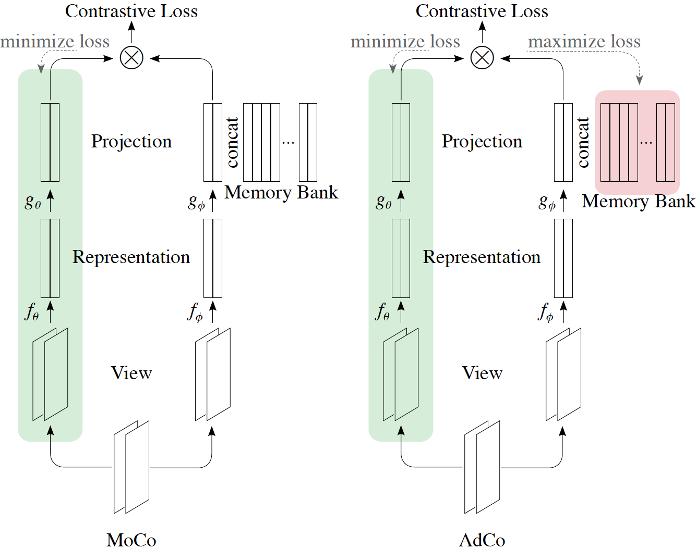

# AdCo
<a href="https://github.com/marktext/marktext/releases/latest">
   
   
   
   
   
</a>   

AdCo is a contrastive-learning based self-supervised learning methods. 

Copyright (C) 2020 Qianjiang*, Xiao Wang*, Wei Hu, Guo-Jun Qi

License: MIT for academic use.

Contact: Guo-Jun Qi (guojunq@gmail.com)

## Citation:
[AdCo: Adversarial Contrast for Efficient Learning of Unsupervised Representations from Self-Trained Negative Adversaries](https://arxiv.org/pdf/2011.08435.pdf)
```
@article{hu2020adco,
  title={AdCo: Adversarial Contrast for Efficient Learning of Unsupervised Representations from Self-Trained Negative Adversaries},
  author={Hu, Qianjiang and Wang, Xiao and Hu, Wei and Qi, Guo-Jun},
  journal={arXiv preprint arXiv:2011.08435},
  year={2020}
}
```

## Introduction
Contrastive learning relies on constructing a collection of negative examples that are sufficiently hard to discriminate against positive queries when their representations are self-trained. Existing contrastive learning methods either maintain a queue of negative samples over minibatches while only a small portion of them are updated in an iteration, or only use the other examples from the current minibatch as negatives. They could not closely track the change of the learned representation over iterations by updating the entire queue as a whole, or discard the useful information from the past minibatches. Alternatively, we present to directly learn a set of negative adversaries playing against the self-trained representation. Two players, the representation network and negative adversaries, are alternately updated to obtain the most challenging negative examples against which the representation of positive queries will be trained to discriminate. We further show that the negative adversaries are updated towards a weighted combination of positive queries by maximizing the adversarial contrastive loss, thereby allowing them to closely track the change of representations over time. Experiment results demonstrate the proposed Adversarial Contrastive (AdCo) model not only achieves superior performances (a top-1 accuracy of 73.2% over 200 epochs and 75.7% over 800 epochs with linear evaluation on ImageNet), but also can be pre-trained more efficiently with much shorter GPU time and fewer epochs.

## Protocol
<p align="center">
  
</p> 

## Installation  
### 1. [`Install git`](https://git-scm.com/book/en/v2/Getting-Started-Installing-Git) 
### 2. Clone the repository in your computer 
```
git clone git@github.com:maple-research-lab/AdCo.git && cd AdCo
```

### 3. Build dependencies.   
You have two options to install dependency on your computer:
#### 3.1 Install with pip and python(Ver 3.6.9).
##### 3.1.1[`install pip`](https://pip.pypa.io/en/stable/installing/).
##### 3.1.2  Install dependency in command line.
```
pip install -r requirements.txt --user
```
If you encounter any errors, you can install each library one by one:
```
pip install torch==1.7.1
pip install torchvision==0.8.2
pip install numpy==1.19.5
pip install Pillow==5.1.0
pip install tensorboard==1.14.0
pip install tensorboardX==1.7
```

#### 3.2 Install with anaconda
##### 3.2.1 [`install conda`](https://docs.conda.io/projects/conda/en/latest/user-guide/install/macos.html). 
##### 3.2.2 Install dependency in command line
```
conda create -n AdCo python=3.6.9
conda activate AdCo
pip install -r requirements.txt 
```
Each time when you want to run my code, simply activate the environment by
```
conda activate AdCo
conda deactivate(If you want to exit) 
```

## Usage
```
python3 main_adco.py -h
  --log_path LOG_PATH   log path for saving models
  -a ARCH, --arch ARCH  model architecture: alexnet | densenet121 |
                        densenet161 | densenet169 | densenet201 | googlenet |
                        inception_v3 | mnasnet0_5 | mnasnet0_75 | mnasnet1_0 |
                        mnasnet1_3 | mobilenet_v2 | resnet101 | resnet152 |
                        resnet18 | resnet34 | resnet50 | resnext101_32x8d |
                        resnext50_32x4d | shufflenet_v2_x0_5 |
                        shufflenet_v2_x1_0 | shufflenet_v2_x1_5 |
                        shufflenet_v2_x2_0 | squeezenet1_0 | squeezenet1_1 |
                        vgg11 | vgg11_bn | vgg13 | vgg13_bn | vgg16 | vgg16_bn
                        | vgg19 | vgg19_bn | wide_resnet101_2 |
                        wide_resnet50_2 (default: resnet50)
  -j N, --workers N     number of data loading workers (default: 32)
  --epochs N            number of total epochs to run
  --start_epoch N       manual epoch number (useful on restarts)
  -b N, --batch_size N  mini-batch size (default: 256), this is the total
                        batch size of all GPUs on the current node when using
                        Data Parallel or Distributed Data Parallel
  --lr LR, --learning_rate LR
                        initial learning rate
  --lr_final LR_FINAL   final learning rate
  --schedule [SCHEDULE [SCHEDULE ...]]
                        learning rate schedule: default: cos scheduler
  --momentum M          momentum of SGD solver
  --wd W, --weight_decay W
                        weight decay (default: 1e-4)
  -p N, --print_freq N  print frequency (default: 10)
  --resume PATH         path to latest checkpoint (default: none)
  --world_size WORLD_SIZE
                        number of nodes for distributed
                        training,args.nodes_num*args.ngpu,here we specify with
                        the number of nodes
  --rank RANK           node rank for distributed training,rank of total
                        threads, 0 to args.world_size-1
  --dist_url DIST_URL   url used to set up distributed training
  --dist_backend DIST_BACKEND
                        distributed backend
  --seed SEED           seed for initializing training.
  --gpu GPU             GPU id to use.
  --multiprocessing_distributed MULTIPROCESSING_DISTRIBUTED
                        Use multi-processing distributed training to launch N
                        processes per node, which has N GPUs. This is the
                        fastest way to use PyTorch for either single node or
                        multi node data parallel training
  --moco_dim MOCO_DIM   feature dimension (default: 128)
  --moco_m MOCO_M       moco momentum of updating key encoder (default: 0.999)
  --moco_t MOCO_T       softmax temperature for network (default: 0.12)
  --mlp MLP             use mlp head
  --cos COS             use cosine lr schedule
  --dataset DATASET     Specify dataset: ImageNet or cifar10
  --choose CHOOSE       choose gpu for training
  --save_path SAVE_PATH
                        model and record save path
  --nmb_crops NMB_CROPS [NMB_CROPS ...]
                        list of number of crops (example: [2, 6])
  --size_crops SIZE_CROPS [SIZE_CROPS ...]
                        crops resolutions (example: [224, 96])
  --min_scale_crops MIN_SCALE_CROPS [MIN_SCALE_CROPS ...]
                        argument in RandomResizedCrop (example: [0.14, 0.05])
  --max_scale_crops MAX_SCALE_CROPS [MAX_SCALE_CROPS ...]
                        argument in RandomResizedCrop (example: [1., 0.14])
  --cluster CLUSTER     number of learnable comparison features
  --memory_lr MEMORY_LR
                        learning rate for adversial memory bank
  --ad_init AD_INIT     use feature encoding to init or not
  --nodes_num NODES_NUM
                        number of nodes to use
  --ngpu NGPU           number of gpus per node
  --master_addr MASTER_ADDR
                        addr for master node
  --master_port MASTER_PORT
                        port for master node
  --node_rank NODE_RANK
                        rank of machine, 0 to nodes_num-1
  --mem_t MEM_T         temperature for memory bank(default: 0.02)
  --mem_wd MEM_WD       weight decay of memory bank (default: 0)
  --sym SYM             train with symmetric loss or not

```

### Unsupervised Training
This implementation only supports multi-gpu, DistributedDataParallel training, which is faster and simpler; single-gpu or DataParallel training is not supported.
#### Single Crop
##### 1 Without symmetrical loss:
```
python3 main_adco.py --mem_wd=1e-4 --cluster=65536 --data=path/to/imagenet2012 --world_size=1 --cos=1 --moco_t=0.12 --print_freq=1000 --save_path=. --rank=0 --cutout=0  --batch_size=256 --mem_t=0.02 --dist_url=tcp://localhost:10001 --memory_lr=3 --moco_m=0.999 --arch=resnet50 --moco_dim=128 --lr=0.03 --sym=0
```
##### 2 With symmetrical loss:
```
python3 main_adco.py --mem_wd=1e-4 --cluster=65536 --data=path/to/imagenet2012 --world_size=1 --cos=1 --moco_t=0.12 --print_freq=1000 --save_path=. --rank=0 --cutout=0  --batch_size=256 --mem_t=0.02 --dist_url=tcp://localhost:10001 --memory_lr=3 --moco_m=0.999 --arch=resnet50 --moco_dim=128 --lr=0.03 --sym=1
```
#### Multi Crop
##### 1 Without symmetrical loss:
```
python3 main_adco.py --mem_wd=1e-4 --cluster=65536 --data=path/to/imagenet2012 --world_size=1 --cos=1 --moco_t=0.12 --print_freq=1000 --save_path=. --rank=0 --cutout=0  --batch_size=256 --mem_t=0.02 --dist_url=tcp://localhost:10001 --memory_lr=3 --moco_m=0.999 --arch=resnet50 --moco_dim=128 --lr=0.03 --sym=0 --multi_crop=1
```
##### 2 With symmetrical loss:
```
python3 main_adco.py --mem_wd=1e-4 --cluster=65536 --data=path/to/imagenet2012 --world_size=1 --cos=1 --moco_t=0.12 --print_freq=1000 --save_path=. --rank=0 --cutout=0  --batch_size=256 --mem_t=0.02 --dist_url=tcp://localhost:10001 --memory_lr=3 --moco_m=0.999 --arch=resnet50 --moco_dim=128 --lr=0.03 --sym=1 --multi_crop=1
```

### Linear Classification
With a pre-trained model, we can easily evaluate its performance on ImageNet with:
```
python3 classification/lincls.py --train_strong=0 --epochs=100 --data=path/to/imagenet2012 -a=resnet50 --lr=10 --batch-size=256 --dist-url=tcp://localhost:10001 --multiprocessing-distributed=1 --world-size=1 --rank=0 --cos=1 --pretrained=path/to/pretrained/model
```
Performance:
<table><tbody>
<!-- START TABLE -->
<!-- TABLE HEADER -->
<th valign="bottom">pre-train<br/>network</th>
<th valign="bottom">pre-train<br/>epochs</th>
<th valign="bottom">Crop</th>
<th valign="bottom">Symmetrical<br/>Loss</th>
<th valign="bottom">AdCo<br/>top-1 acc.</th>
<!-- TABLE BODY -->
<tr><td align="left">ResNet-50</td>
<td align="center">200</td>
<td align="center">Single</td>
<td align="center">No</td>
<td align="center">68.6</td>
</tr>
<tr><td align="left">ResNet-50</td>
<td align="center">200</td>
<td align="center">Multi</td>
<td align="center">No</td>
<td align="center">73.2</td>
</tr>
<tr><td align="left">ResNet-50</td>
<td align="center">800</td>
<td align="center">Single</td>
<td align="center">No</td>
<td align="center">72.8</td>
</tr>
<tr><td align="left">ResNet-50</td>
<td align="center">800</td>
<td align="center">Multi</td>
<td align="center">No</td>
<td align="center">75.7</td>
</tr>
<tr><td align="left">ResNet-50</td>
<td align="center">200</td>
<td align="center">Single</td>
<td align="center">Yes</td>
<td align="center">70.6</td>
</tr>
</tbody></table>

### Transfering to VOC07 Classification
#### 1 Downloading [Dataset](http://host.robots.ox.ac.uk/pascal/VOC/voc2007/VOCtrainval_06-Nov-2007.tar).
#### 2 Linear Evaluation:
```
# in VOC_CLF folder
python3 main.py --data=path/to/voc07 --pretrained=path/to/pretrained/model
```

### Transfering to Places205 Classification
#### 1 Downloading [Dataset](http://places.csail.mit.edu/user/index.php)
#### 2 Linear Evaluation:
```
python3 classification/lincls.py --train_strong=0 --sgdr=1 --epochs=100 --data=path/to/places205 -a=resnet50 --lr=5 --batch-size=256 --dist-url=tcp://localhost:10001 --multiprocessing-distributed=1 --world-size=1 --rank=0 --cos=1 --pretrained=path/to/pretrained/model
```

### Transferring to Object Detection
Please refer to [MoCo Detection](https://github.com/facebookresearch/moco/blob/master/detection), we adopted the same protocol for detection.


